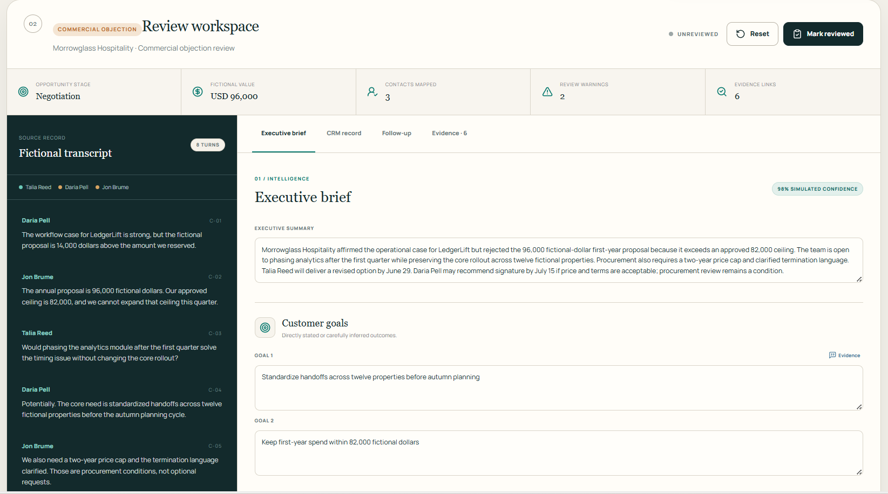

# Commercial Conversation Intelligence

> **This independent portfolio project was created using personal equipment, personal accounts, and entirely fictional data. It is not affiliated with, sponsored by, connected to, or derived from any employer or customer system. It is a technical demonstration and is not currently offered as a commercial service.**

Commercial Conversation Intelligence is a polished, deterministic portfolio demonstration of how a fictional sales-call transcript can move through a structured review workflow. The public application uses only bundled fictional transcripts and precomputed fictional outputs. It does not perform live AI analysis, accept real conversation data, call an external service, or write to a CRM.



*The entirely fictional Commercial Objection scenario, with a transcript mapped into an editable executive brief and evidence-backed review workspace.*

## What the demonstration includes

- Four original fictional call scenarios: discovery, qualification, technical evaluation, and commercial objection handling.
- CRM-ready account, contact, opportunity, and activity fields.
- Executive summaries, needs, objections, qualification signals, risks, follow-up tasks, and email drafts.
- Exact transcript evidence navigation and simulated confidence warnings.
- Editable review state with user-edited markers and reset behavior.
- Client-side JSON, CRM CSV, task CSV, and email-draft exports.
- No persistence, accounts, analytics, credentials, API routes, or external writes.

## Run locally

```bash
npm install
npm run dev
```

Open `http://localhost:3000`.

## Verify

```bash
npm test
npm run lint
npm run build
```

The production build is a static export in `out/`.

## Architecture and boundaries

- [Application architecture](docs/architecture.md)
- [CRM integration architecture guide](docs/crm-integration-architecture.md)
- [Data and independence boundaries](docs/data-and-independence-boundaries.md)
- [Evaluation strategy](docs/evaluation-strategy.md)
- [Optional private live-AI boundary](docs/optional-private-live-ai.md)

## Rights

Copyright © 2026 Adeel Tagar. All rights reserved. See [LICENSE](LICENSE).
